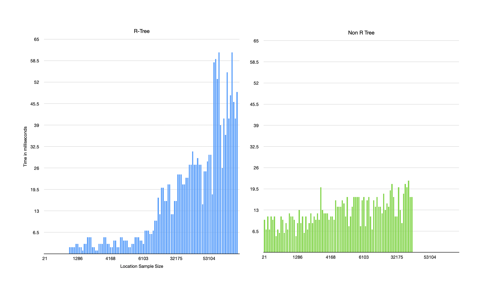

## Cached Locations - Preload Map Locations 
#### Problem: App takes several seconds to load map locations

### Discussion
***Solution***

After fetching charging stations, persist them to local storage in an R-Tree. As the map's visible area changes, the widget loads cached locations while making the API call to the recommendation engine.

***Challenges***

- Location sample size
- Capturing comparable metrics

***Implementation*** 

This example uses the Google Maps SDK and includes an 80mb geojson file that represents 340,000 unique locations in California and Texas. The sheer amount of JSON data presents some issues worth considering on the mobile end. While the data set size is much larger than the number of charges the application would load from its cache, it gives an idea of how it performs at scale. The R-tree data structure performs very well with less than ten thousands locations, so it would be a great solution for storing and retrieving location data in the app.

I used two approaches to the problem: 
1) iterate a simple unordered lists of locations with gps coordinates to see if they fall inside the map's visible area
2) use an R Tree to check whether a location falls inside the visible area

Testing yielded some interesting results. The R-Tree performed extremely well when searching less than ten thousand locations but performance suffered as the sample size increased beyond twenty thousand. 

- Under 10,000 locations
  - R-Tree: 5.5 ms
  - Non-R-Tree: 35.8 ms
- 10k - 30k locations
  - R-Tree: 23.4 ms
  - Non-R-Tree: 39.4 ms
- Above 30k locations
  - R-Tree: 57.0 ms
  - Non-R-Tree: 45.5 ms

I don't have any metrics on the R-Tree internal implementation, but it's likely related to how R-Tree's are structured. Each node is a tuple containing a rectangle and items that lie within the rectangle. The items can be either a child node or leaf nodes which the rectangle contains. When searching for items, we traverse the tree by checking the rectangles to see if they contain our item. Since we do not have to check every item in the collection, searches happen very quickly. Creating the rectangle keys will also create additional items in the collection which may explain the performance degradation above 30k items when the search area is too large.

Given the sample sizes and zoom levels that the application will be used with, the R-Tree provides exceptional performance for the likely real-world use case.
